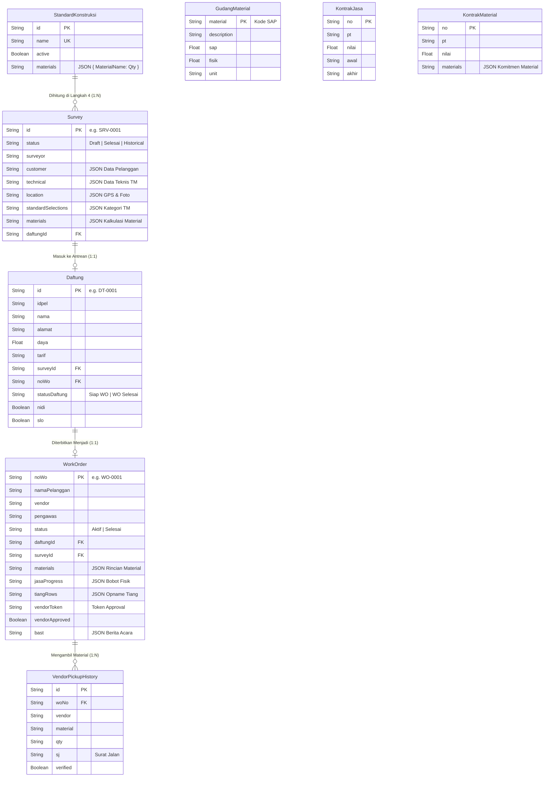
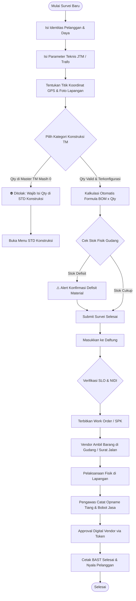

# ⚡ PROMOTOR V1.0 — Project Monitoring & Material Control System
> **Sistem Informasi Terintegrasi Perencanaan, Pengawasan Proyek Distribusi, dan Pengendalian Material Konstruksi PLN UP3 / ULP**

---

## 📑 DAFTAR ISI
1. [Ringkasan Eksekutif & Tujuan Sistem](#1-ringkasan-eksekutif--tujuan-sistem)
2. [Spesifikasi Teknis & Arsitektur Teknologi](#2-spesifikasi-teknis--arsitektur-teknologi)
3. [Matriks Hak Akses Pengguna (Role-Based Access Control / RBAC)](#3-matriks-hak-akses-pengguna-role-based-access-control--rbac)
4. [Spesifikasi 8 Modul Utama Aplikasi](#4-spesifikasi-8-modul-utama-aplikasi)
5. [Entity Relationship Diagram (ERD) & Struktur Database](#5-entity-relationship-diagram-erd--struktur-database)
6. [Diagram Alur Bisnis & Flowchart Operasional](#6-diagram-alur-bisnis--flowchart-operasional)
7. [Panduan Penggunaan Langkah demi Langkah (User Guide)](#7-panduan-penggunaan-langkah-demi-langkah-user-guide)
8. [Struktur Direktori & Kode Sumber](#8-struktur-direktori--kode-sumber)
9. [Panduan Instalasi & Menjalankan di Lingkungan Lokal](#9-panduan-instalasi--menjalankan-di-lingkungan-lokal)

---

## 1. Ringkasan Eksekutif & Tujuan Sistem

**PROMOTOR (Project Monitoring & Material Control)** adalah aplikasi berbasis web modern yang dirancang khusus untuk memecahkan tantangan operasional dalam pengelolaan proyek ketenagalistrikan pada unit distribusi PLN (UP3 dan ULP). 

### 🎯 Masalah yang Diselesaikan:
1. **Perhitungan Kebutuhan Material Manual**: Menghilangkan risiko salah hitung material survei dengan kalkulasi otomatis berbasis **Master Matriks Standar Konstruksi TM**.
2. **Keterlambatan Proyek Akibat Defisit Stok**: Menyediakan kalkulasi agregasi kebutuhan material survei secara *real-time* berbanding saldo fisik gudang dan kontrak pengadaan.
3. **Pengawasan Progres Lapangan yang Terpecah**: Menyatukan opname tiang, bobot persentase jasa, verifikasi vendor digital (*Token-based Vendor Approval*), hingga cetak Berita Acara Serah Terima (BAST).
4. **Monitoring SLA Pelanggan (TMP)**: Memastikan proses dari survei hingga terbit Perintah Kerja (PK/WO) terkontrol dalam batasan Tingkat Mutu Pelayanan (24–100 hari kerja).

---

## 2. Spesifikasi Teknis & Arsitektur Teknologi

| Komponen | Teknologi / Library | Keterangan |
| :--- | :--- | :--- |
| **Framework Utama** | Next.js 14 (App Router) | Server-Side Rendering (SSR) & API Route Handlers |
| **Bahasa Pemrograman** | TypeScript (Strict Mode) | Type-safe end-to-end data transfer |
| **Desain & Styling** | TailwindCSS + Vanilla CSS Tokens | Responsif, dark/light contrast modern, transisi halus |
| **Database & ORM** | PostgreSQL (Supabase) + Prisma ORM | Relasional, schema-driven, konektivitas pool stabil |
| **Peta & Geotagging** | Leaflet / OpenStreetMap API | Penentuan koordinat GPS & visualisasi titik survei |
| **Eksportir Dokumen** | `xlsx` (Excel) & `jspdf` / `jspdf-autotable` | Ekspor rekap data survei, stok gudang, matriks TM, PDF |
| **Komponen Ikon** | Lucide React | Ikon UI modern dan informatif |
| **State Management** | React Context API (`PromotorContext`) | Optimistic update, cache hydration (0ms load) |

---

## 3. Matriks Hak Akses Pengguna (Role-Based Access Control / RBAC)

Sistem PROMOTOR dilengkapi 7 Role Otorisasi dengan wewenang yang terisolasi:

```
Super Admin > Manager UP3/ULP > Spv Teknik > Surveyor > Admin Gudang > Pengawas > Vendor
```

| Modul / Menu | Super Admin | Manager | Spv Teknik | Surveyor | Admin Gudang | Pengawas Lapangan | Vendor Pelaksana |
| :--- | :---: | :---: | :---: | :---: | :---: | :---: | :---: |
| **STD KONSTRUKSI** | ✏️ Kelola | 👁️ Lihat | ✏️ Kelola | 👁️ Lihat | 👁️ Lihat | 👁️ Lihat | ❌ Akses |
| **SURVEY** | ✏️ Kelola | 👁️ Lihat | ✏️ Kelola | ✏️ Input & Kirim | 👁️ Lihat | 👁️ Lihat | ❌ Akses |
| **DAFTUNG** | ✏️ Kelola | 👁️ Lihat | ✏️ Kelola | 👁️ Lihat | 👁️ Lihat | 👁️ Lihat | ❌ Akses |
| **WORK ORDER** | ✏️ Kelola | 👁️ Lihat | ✏️ Terbitkan | ❌ Akses | 👁️ Lihat | ✏️ Update | 👁️ Lihat Sendiri |
| **PENGAWASAN** | ✏️ Kelola | 👁️ Lihat | ✏️ Approval | ❌ Akses | 👁️ Lihat | ✏️ Catat Opname | ✏️ Konfirmasi Token |
| **GUDANG** | ✏️ Kelola | 👁️ Lihat | 👁️ Lihat | ❌ Akses | ✏️ Kelola Stok | 👁️ Cek Stok | ❌ Akses |
| **KONTRAK** | ✏️ Kelola | 👁️ Lihat | ✏️ Pantau | ❌ Akses | 👁️ Lihat | ❌ Akses | ❌ Akses |
| **KEB MATERIAL** | ✏️ Kelola | 👁️ Lihat | ✏️ Analisis | ❌ Akses | ✏️ Analisis | ❌ Akses | ❌ Akses |

*Keterangan:*  
- ✏️ **Kelola**: Hak penuh tambah, edit, hapus, ekspor.  
- 👁️ **Lihat**: Hak observasi data (read-only) & ekspor laporan.  
- ❌ **Akses**: Menu disembunyikan / diblokir dari antarmuka.

---

## 4. Spesifikasi 8 Modul Utama Aplikasi

### 1. 📐 Modul STD KONSTRUKSI (Master Matriks TM)
- **Fungsi**: Pusat formula *Bill of Materials* (BOM) standar PLN untuk seluruh konstruksi Jaringan Tegangan Menengah (contoh: 1B, 2B, 3B, TM-1, TM-2, Cantilever, Portal, Guy Wire).
- **Fitur Utama**:
  - Matriks dinamis kuantitas material per kategori konstruksi.
  - Tambah, edit kuantitas per komponen material, dan aktivasi/nonaktivasi kategori.
  - Import / Export Master Matriks TM via Excel dan PDF bertandatangan resmi.

### 2. 📍 Modul SURVEY (Input & Baseline Pelanggan)
- **Fungsi**: Registrasi data lapangan calon pelanggan TM/TR dengan validasi otomatis.
- **Wizard 5 Langkah**:
  1. *Data Pelanggan*: Nama, IDPEL, Alamat, Daya (VA), Tarif, No Telepon.
  2. *Data Teknis*: Tipe Gardu (Portal/Cantilever), Fasa, Panjang JTM/JTR, Kapasitas Trafo.
  3. *Lokasi & Koordinat*: GPS Geolocation, Picker Peta Interaktif, dan Upload Foto Geotagging.
  4. *Kategori & Material*: Pemilihan kategori standar konstruksi. **Sistem otomatis mengunci kategori jika qty material di menu STD Konstruksi masih 0**, dan menampilkan status stok gudang (*Tersedia / Defisit*).
  5. *Review & Submit*: Validasi akhir dan penyimpanan ke database.
- **Integrasi**: Konfirmasi sekali klik untuk memindahkan survei yang berstatus `Selesai` ke antrean **Daftung**.

### 3. ⏳ Modul DAFTUNG (Monitoring SLA & TMP)
- **Fungsi**: Pengelolaan antrean pelanggan siap bayar/terpasang yang masuk dari survei atau input manual.
- **Fitur Utama**:
  - Kontrol SLA Tingkat Mutu Pelayanan (TMP 24 / 45 / 100 hari kerja).
  - Status Perizinan Instalasi: Toggle Sertifikat Laik Operasi (**SLO**) dan Nomor Identitas Instalasi Tenaga Listrik (**NIDI**).
  - Satu-klik konversi antrean Daftung menjadi **Work Order (WO)** resmi.

### 4. 📋 Modul WORK ORDER (Perintah Kerja & SPK)
- **Fungsi**: Penerbitan Surat Perintah Kerja (SPK) untuk vendor pelaksana jaringan dan tiang.
- **Fitur Utama**:
  - Penomoran otomatis No WO (Format: `WO-xxxx` atau `295.07.WO.YYYY`).
  - Penugasan Vendor Pelaksana, Pengawas Utama, dan Pengawas Kedua.
  - Pemetaan Pagu Kontrak Jasa dan Kontrak Material terkait.
  - Pencatatan Keterangan Kendala Lapangan (Izin Right of Way / Pohon, Penolakan Warga, dll).

### 5. 🔍 Modul PENGAWASAN (Progress, Opname Tiang, & BAST)
- **Fungsi**: Pengawasan lapangan secara komprehensif selama pelaksanaan konstruksi.
- **Fitur Utama**:
  - *Opname Tiang*: Monitoring tiang beton (kebutuhan survei vs realisasi terpasang vs vendor pabrikan).
  - *Bobot Persentase Jasa*: Perhitungan otomatis progres fisik (Pondasi, Konstruksi, Penarikan Jaringan, Kerangka, Trafo & APP).
  - *Vendor Portal Approval*: Fitur verifikasi digital tanpa login menggunakan **Vendor Token** unik untuk persetujuan berita acara oleh pihak rekanan.
  - *Cetak BAST Digital*: Berita Acara Serah Terima pekerjaan lengkap dengan status laik operasi.

### 6. 🏢 Modul GUDANG (Stok Fisik & SAP)
- **Fungsi**: Pengendalian saldo material logistik PLN.
- **Fitur Utama**:
  - Sinkronisasi Saldo Sistem (SAP) vs Saldo Riil Fisik Gudang.
  - Indikator Selisih Fisik & SAP untuk kontrol kebocoran material (*Loss Control*).
  - *Vendor Pickup History*: Pencatatan penarikan barang keluar gudang berbasis Nomor Surat Jalan (SJ).

### 7. 📄 Modul KONTRAK (Pagu Jasa & Material)
- **Fungsi**: Manajemen perjanjian kerja sama vendor jasa borongan dan pabrikan material.
- **Fitur Utama**:
  - Kontrak Jasa: Nomor kontrak, nama PT, tanggal periode kerja, dan nilai pagu anggaran.
  - Kontrak Material: Rincian kuantitas komitmen pengadaan material per vendor pabrikan.
  - *Transit Material Map*: Perhitungan material yang sedang dalam pengiriman/kontrak.

### 8. 📊 Modul KEB MATERIAL (Kalkulasi Kekurangan)
- **Fungsi**: Analisis kebutuhan material makro berbasis rencana kerja.
- **Rumus Komparasi**:
  $$\text{Defisit / Kesiapan} = (\text{Stok Fisik Gudang} + \text{Material dalam Kontrak}) - \text{Total Kebutuhan Survei}$$
- **Fitur Utama**:
  - Peringatan dini (*Early Warning Indicator*) jika terdapat material kritis bernilai minus.
  - Ekspor kalkulasi pengadaan untuk pengajuan PR/PO ke bagian Pengadaan PLN UP3.

---

## 5. Entity Relationship Diagram (ERD) & Struktur Database

Aplikasi PROMOTOR menggunakan relasi data PostgreSQL terstruktur melalui Prisma ORM:



---

## 6. Diagram Alur Bisnis & Flowchart Operasional

### A. High-Level Lifecycle Alur Proyek



---

## 7. Panduan Penggunaan Langkah demi Langkah (User Guide)

### Skenario 1: Input Survei Pelanggan Baru
1. Buka modul **SURVEY (Input & Baseline)** melalui navigasi sidebar.
2. Klik tombol **+ Tambah Survey**.
3. **Langkah 1 (Data Pelanggan)**: Masukkan Nama, IDPEL 12 Digit, Alamat, Daya (VA), dan Tarif. Klik *Lanjut*.
4. **Langkah 2 (Data Teknis)**: Pilih tipe gardu (*Portal / Cantilever*), fasa, dan estimasi panjang kabel JTM/JTR. Klik *Lanjut*.
5. **Langkah 3 (Lokasi & Koordinat)**: Klik *Gunakan Titik GPS Saya* atau geser penanda pin pada peta interaktif. Unggah foto geotagging lokasi gardu. Klik *Lanjut*.
6. **Langkah 4 (Kategori & Material)**:
   - Klik **Tambah Kategori**.
   - Pilih jenis standar (misal: `1B`, `2B`, `TM-1`).
   - *Catatan:* Jika standar belum memiliki material atau bernilai `0` di menu Standar Konstruksi, sistem akan memblokir penambahan dan mengarahkan Anda untuk mengisi kuantitas master terlebih dahulu.
   - Periksa tabel kalkulasi dan status ketersediaan gudang. Klik *Lanjut*.
7. **Langkah 5 (Review & Submit)**: Periksa ringkasan. Klik **Submit Survey**.
8. Setelah berstatus `Selesai`, klik tombol **Masukkan ke Daftung** pada tabel survei.

### Skenario 2: Menerbitkan Work Order dari Daftung
1. Buka modul **DAFTUNG (Monitoring SLA & TMP)**.
2. Cari nama pelanggan yang siap dikerjakan.
3. Pastikan kelayakan perizinan dengan mengaktifkan toggle **NIDI** dan **SLO**.
4. Klik tombol **Terbitkan WO**.
5. Pilih Vendor Pelaksana, Pengawas PLN, dan Nomor Kontrak Jasa.
6. Klik **Konfirmasi Terbitkan WO**. Sistem otomatis menerbitkan data ke modul **WORK ORDER**.

### Skenario 3: Pengawasan Progres Lapangan & Penerbitan BAST
1. Buka modul **PENGAWASAN (Reservasi & Progress)**.
2. Pilih nomor Work Order terkait.
3. Pada tab **Bobot Jasa**, centang pekerjaan yang telah selesai (Pondasi, Tiang, Konstruksi, Penarikan, Trafo).
4. Pada tab **Opname Tiang**, verifikasi jumlah tiang yang telah tertanam di lapangan.
5. Klik **Approval Vendor**: Salin token verifikasi untuk divalidasi oleh pihak kontraktor pelaksana.
6. Setelah progres 100% dan terverifikasi, klik **Cetak BAST** untuk mengunduh dokumen serah terima resmi dalam format PDF.

---

## 8. Struktur Direktori & Kode Sumber

```
PROMOTOR-V1/
├── prisma/
│   └── schema.prisma              # Definisi skema database PostgreSQL
├── src/
│   ├── app/
│   │   ├── api/
│   │   │   └── promotor/
│   │   │       └── route.ts       # Endpoint CRUD backend & action handler terpusat
│   │   ├── layout.tsx             # Root layout & font setup
│   │   └── page.tsx               # Entry point aplikasi & switch antarmuka modul
│   ├── components/
│   │   ├── auth/
│   │   │   └── LoginPage.tsx      # Tampilan autentikasi & pemilihan role pengguna
│   │   ├── layout/
│   │   │   ├── Header.tsx         # Header sistem, profil, & quick logout
│   │   │   └── Sidebar.tsx        # Navigasi 8 modul & kontrol otorisasi RBAC
│   │   ├── modules/
│   │   │   ├── StdKonstruksiModule.tsx # Manajemen Master Matriks TM
│   │   │   ├── SurveyModule.tsx        # Wizard 5 langkah survei & kalkulasi
│   │   │   ├── DaftungModule.tsx       # Antrean pelanggan & kontrol TMP/SLA
│   │   │   ├── WorkOrderModule.tsx     # Manajemen Work Order & penugasan
│   │   │   ├── PengawasanModule.tsx    # Opname fisik, progres jasa, vendor token & BAST
│   │   │   ├── GudangModule.tsx        # Manajemen stok SAP vs Fisik & vendor pickup
│   │   │   ├── KontrakModule.tsx       # Monitoring pagu jasa & pabrikan material
│   │   │   └── KebMaterialModule.tsx   # Kalkulasi kebutuhan & analisis defisit material
│   │   └── ui/
│   │       ├── Badge.tsx          # Komponen status badge
│   │       ├── ConfirmDialog.tsx  # Modal dialog konfirmasi terstandarisasi
│   │       ├── ExportDropdown.tsx # Dropdown ekspor multi-format (Excel/PDF)
│   │       ├── MapLocationPicker.tsx # Komponen Peta Leaflet & Geotagging
│   │       ├── Modal.tsx          # Wrapper modal serbaguna
│   │       └── Toast.tsx          # Komponen notifikasi pop-up
│   ├── context/
│   │   └── PromotorContext.tsx    # State management global & API dispatcher
│   └── lib/
│       ├── exportUtils.ts         # Utility generator file Excel & PDF
│       ├── prisma.ts              # Inisialisasi Prisma Client singleton
│       └── types.ts               # Interface TypeScript & model data
├── .env                           # Konfigurasi variabel lingkungan & koneksi database
├── package.json                   # Daftar dependensi & script project
└── README.md                      # Ringkasan singkat proyek
```

---

## 9. Panduan Instalasi & Menjalankan di Lingkungan Lokal

### Prasyarat:
- Node.js versi 18.17 atau lebih baru
- Database PostgreSQL (Lokal atau Supabase Cloud)

### Langkah Instalasi:

1. **Clone / Buka Direktori Proyek**:
   ```bash
   cd /Users/sehandikitriansyah/Documents/PROMOTOR-V1
   ```

2. **Instal Dependensi**:
   ```bash
   npm install
   ```

3. **Konfigurasi File `.env`**:
   Pastikan konfigurasi string koneksi database PostgreSQL telah sesuai:
   ```env
   DATABASE_URL="postgresql://postgres:[PASSWORD]@[HOST]:[PORT]/postgres?pgbouncer=true"
   DIRECT_URL="postgresql://postgres:[PASSWORD]@[HOST]:[PORT]/postgres"
   ```

4. **Sinkronisasi Database Prisma**:
   ```bash
   npx prisma db push
   ```

5. **Jalankan Server Development Lokal**:
   ```bash
   npm run dev
   ```

6. **Buka Aplikasi di Browser**:
   Akses `http://localhost:3000` (atau port yang tertera pada terminal).

---

*Dokumentasi ini disusun sebagai standar operasional dan arsitektur resmi aplikasi PROMOTOR V1.0 PLN UP3 / ULP Distribusi.*
